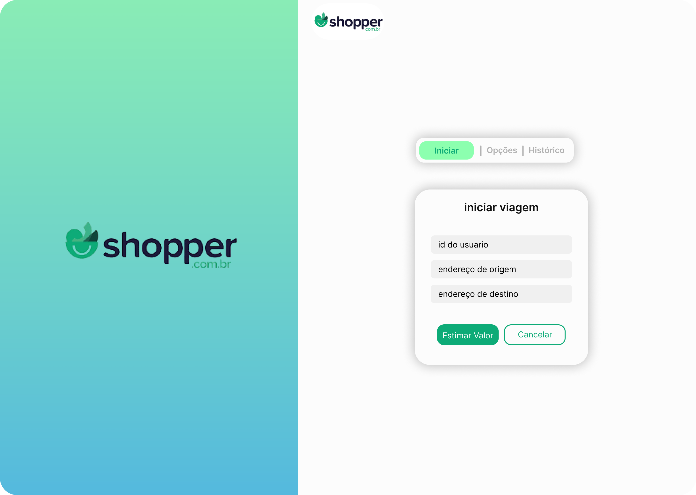
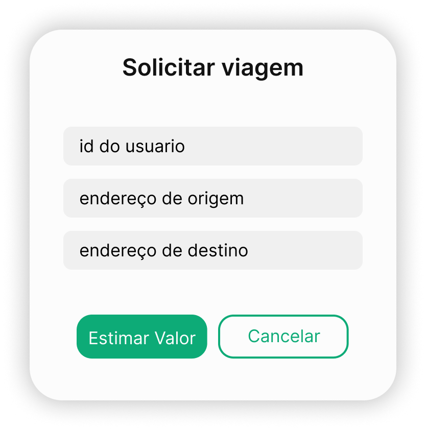

# shopper

<div style="display: flex; gap: 10px; flex-wrap: wrap; align-items: flex-start;">
  
  
  
  
</div>


<details>
<summary>API - NestJS(node)</summary>

## API - NestJS(node)
- https://shopper-0tsi.onrender.com/api

| Metodo |  Rota | Descricao |
|---|---|---|
| POST | user/create-driver | cadastrar motorista no banco |
| POST | user/create-passenger | cadastrar passageiro no banco |
| POST | user/create-vehicle | cadastrar veículo no banco |
| GET | user/driver | listar motoristas |
| GET | user/passenger | listar passageiros |
| GET | user/vehicle | listar veículos |
| POST | ride/estimate | calcula o trajeto e mostra o motorista |
| PATCH | ride/confirm | salva a viagem no banco |
| PATCH | {driver_id}/ride/{customer_id} | busca historico de viagens |

- Integrado aos serviços do google: Directions API, Routes API
- Prisma como ORM (gerenciador de banco)
- Testes unitários.
- Exceptions personalizados
- Documentação Swagger

```
#CRIAÇÃO DA API
- npm i -g @nestjs/cli
- nest new api
- cd api
- npm i --save-dev jest ts-jest @nestjs/testing @types/jest prisma
- npm i @nestjs/common class-validator class-transformer http-status-codes @nestjs/swagger swagger-ui-express @prisma/client @googlemaps/google-maps-services-js dotenv cors
- npx prisma init

#SETTINGS
- npx prisma migrate dev --name init
- npx prisma studio
- npm run test
- npm run test -- <nome-do-teste>
- npm run test -- --coverage
```

</details>

<details>
<summary>Front web - React TypeScript</summary>

## Front web - React TypeScript
- https://shopper-ashy-three.vercel.app/
- Integrado aos serviços do google: Directions API, Maps API

</details>


<details>
<summary>Banco de dados - postgresSQL</summary>

## Banco de dados - postgresSQL


- banco postgres SQL

</details>
